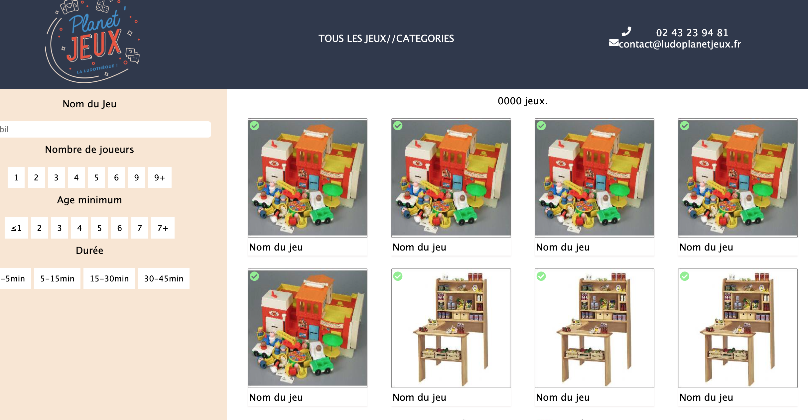

# Base de code pour le catalogue de la Ludothèque Planet'Jeux du Mans

Projet créé avec les technologies suivantes : 

- HTML5 // CSS3 // SASS

## Tester le projet

Clonez le projet : 

`git clone https://github.com/AlexandreKuzo/Planetjeuxtemplates.git `

## Travailler avec le projet et le modifier

- Clonez le projet également
- Installez les dépendances avec la commande `npm install`
- Lancez SASS pour la compilation avec la commande `npm run sass`

